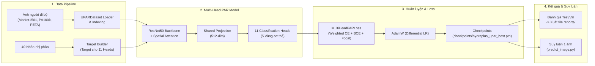
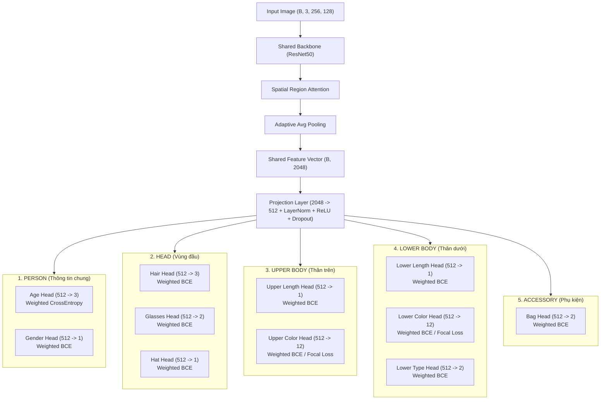

# UPAR Multi-Head Pedestrian Attribute Recognition

Hệ thống nhận diện thuộc tính người đi bộ (Pedestrian Attribute Recognition - PAR) huấn luyện trên bộ dữ liệu hợp nhất **UPAR_UNIFIED** (Market1501 + PA100k + PETA, 145,656 mẫu, 40 thuộc tính nhị phân).

Dự án **kiến trúc Multi-Task / Multi-Head Classification** với 11 head chuyên biệt theo từng nhóm ngữ nghĩa, giúp mô hình học tốt hơn các thuộc tính có phân bố và bản chất khác nhau (nhị phân, đa lớp loại trừ lẫn nhau, đa nhãn).

---

## Sơ đồ Tổng quan Pipeline Hệ thống (High-Level System Overview)



---

## 1. Tổng quan kiến trúc

> 💡 **Lưu ý về thuật ngữ**: Trong tài liệu này, cần phân biệt rõ hai khái niệm:
> 1. **Body Region "HEAD" (Vùng đầu)**: Vùng cơ thể phần đầu người (gồm các thuộc tính tóc, kính, mũ).
> 2. **Classification Head (Đầu ra phân loại)**: Thuật ngữ trong Deep Learning chỉ nhánh mạng nơ-ron thực hiện nhiệm vụ dự đoán cho một nhóm thuộc tính (ví dụ: `age_head`, `gender_head`).

Kiến trúc mô hình được tổ chức theo cấu trúc **2 Tầng (2-Level Hierarchy)**:
- **Tầng 1 (Body Regions - 5 Vùng cơ thể)**: Nhóm 40 thuộc tính UPAR theo ngữ nghĩa cơ thể người (`PERSON`, `HEAD`, `UPPER BODY`, `LOWER BODY`, `ACCESSORY`).
- **Tầng 2 (Classification Heads - 11 Đầu ra phân loại)**: Các nhánh output kỹ thuật chuyên biệt với hàm Loss và số chiều phù hợp cho từng nhóm thuộc tính.



### Bảng cấu trúc 2 Tầng: 5 Vùng cơ thể & 11 Classification Heads

| Vùng cơ thể (Body Region) | # | Head Name | Attributes Chi Tiết | Out Dim | Loss Function | Đặc điểm & Phân bố nhãn |
|---|---|---|---|---|---|---|
| **PERSON** (Thông tin chung) | 1 | `age` | Young, Adult, Old | 3 | `CrossEntropyLoss` (weighted) | Multi-class loại trừ (99.98% sum=1) |
| | 2 | `gender` | Female | 1 | `BCEWithLogitsLoss` (pos_weight) | Nhị phân |
| **HEAD** (Vùng đầu) | 3 | `hair` | Short, Long, Bald | 3 | `BCEWithLogitsLoss` (pos_weight) | Đa nhãn |
| | 4 | `glasses` | Normal, Sun | 2 | `BCEWithLogitsLoss` (pos_weight) | Đa nhãn, hiếm |
| | 5 | `hat` | Hat | 1 | `BCEWithLogitsLoss` (pos_weight) | Nhị phân, hiếm |
| **UPPER BODY** (Thân trên) | 6 | `upper_length` | Short Sleeve | 1 | `BCEWithLogitsLoss` (pos_weight) | Nhị phân |
| | 7 | `upper_color` | 12 màu (Black..Other) | 12 | `BCEWithLogitsLoss` / `FocalLoss` | Đa nhãn, mất cân bằng mạnh |
| **LOWER BODY** (Thân dưới) | 8 | `lower_length` | Short | 1 | `BCEWithLogitsLoss` (pos_weight) | Nhị phân |
| | 9 | `lower_color` | 12 màu (Black..Other) | 12 | `BCEWithLogitsLoss` / `FocalLoss` | Đa nhãn, mất cân bằng mạnh nhất |
| | 10 | `lower_type` | Trousers&Shorts, Skirt&Dress | 2 | `BCEWithLogitsLoss` (pos_weight) | Đa nhãn |
| **ACCESSORY** (Phụ kiện) | 11 | `bag` | Backpack, Bag | 2 | `BCEWithLogitsLoss` (pos_weight) | Đa nhãn |

**Tổng kích thước đầu ra**: (3+1) + (3+2+1) + (1+12) + (1+12+2) + 2 = **40 outputs** (khớp chính xác $100\%$ với 40 thuộc tính nhị phân gốc của UPAR).

> **Ghi chú**: Nhãn gốc trong `UPAR_UNIFIED` luôn giữ nguyên dạng nhị phân `{0, 1}` — việc nhóm 2 tầng theo 5 Vùng cơ thể và 11 Classification Heads chỉ diễn ra ở tầng target-builder / loss, không sửa đổi dữ liệu annotation gốc.

---

## 2. Cấu trúc thư mục

```text
.
├── 3 Datasets/                     # Dữ liệu ảnh người đi bộ gốc (Market1501, PA100k, PETA)
├── UPAR_UNIFIED/                   # Thư mục dữ liệu UPAR hợp nhất
│   └── annotations/
│       ├── unified_annotations.pkl # Nhãn gốc 40 thuộc tính
│       ├── train.pkl, val.pkl, test.pkl
│       └── label_statistics.csv
├── configs/
│   └── upar.yaml                   # Cấu hình dataset, loss_weights, training hyperparameters
├── datasets/
│   └── upar/
│       └── loader.py               # UPARDataset, HEAD_SPECS, build_batch_multi_head_targets()
├── models/
│   └── hydraplus/
│       ├── backbone.py             # ResNet50 feature extractor
│       └── par_model.py            # UnifiedPARModel — SpatialAttention + 11 Heads
├── training/
│   ├── loss.py                     # MultiHeadPARLoss (Weighted CE + BCE + FocalLoss)
│   ├── evaluate.py                 # compute_par_metrics, compute_head_metrics, mAP
│   └── train.py                    # Training pipeline chính (Differential LR, AMP)
├── inference/
│   └── predict_image.py            # Suy luận 1 ảnh, xuất bảng kết quả + vẽ biểu đồ
├── checkpoints/
│   └── hydraplus_upar_best.pth     # Checkpoint mô hình tốt nhất lưu tại project ổ C (98 MB)
├── reports/
│   ├── training_report.txt         # Báo cáo huấn luyện chi tiết lưu tại project ổ C
│   ├── metrics.csv                 # Tóm tắt chỉ số Test/Val
│   └── per_attribute_metrics.csv   # Chỉ số 40 thuộc tính
├── tests/
│   ├── test_dataset.py
│   ├── test_model.py
│   └── test_training.py
└── README.md
```

---

## 3. Cài đặt (Installation)

### Bước 1 — Kích hoạt Virtual Environment (.venv)
```powershell
.\.venv\Scripts\Activate.ps1
```

### Bước 2 — Cài đặt Dependencies
```powershell
pip install -r requirements.txt
```

Yêu cầu GPU CUDA để huấn luyện trong thời gian hợp lý (ResNet50, batch 64, ~145k mẫu).

---

## 4. Huấn luyện (Training)

```powershell
python training/train.py --epochs 10 --batch_size 64
```

### Tham số CLI quan trọng

| Tham số | Mặc định | Mô tả |
|---|---|---|
| `--config` | `configs/upar.yaml` | Đường dẫn file cấu hình YAML |
| `--unified_root` | `UPAR_UNIFIED` | Thư mục dữ liệu UPAR hợp nhất trong project |
| `--sample_ratio` | `1.0` | Tỉ lệ mẫu dùng để train (dùng `0.01` để test nhanh pipeline) |
| `--img_height / --img_width` | `256 / 128` | Kích thước ảnh input chuẩn PAR |
| `--epochs` | `10` | Số lượng epoch huấn luyện |
| `--batch_size` | `64` | Kích thước batch |
| `--lr` | `3e-4` | Learning rate cơ sở cho Heads (Backbone dùng `args.lr * 0.1` = `3e-5`) |
| `--pretrained` | `True` | Dùng ResNet50 pretrained ImageNet |
| `--num_workers` | `4` | Số worker cho DataLoader |

### Cơ chế kỹ thuật chính trong Training Loop

1. **Differential Learning Rate (Tốc độ học phân tầng)**:
   - Backbone ResNet50 & Spatial Attention: `lr = args.lr * 0.1` (`3e-5`). Giúp bảo tồn các đặc trưng visual pre-trained từ ImageNet.
   - 11 Classification Heads & Shared Projection Layer: `lr = args.lr` (`3e-4`).
2. **Cơ chế cân bằng lớp (Class Imbalance Handling)**:
   - `MultiHeadPARLoss.compute_pos_weights_from_labels()` tự động tính `pos_weight` cho từng head BCE theo công thức `clip(sqrt(neg_count / pos_count), 0.5, max_w)` (mặc định `max_w=50.0`).
   - Tự động tính trọng số nghịch đảo tần suất (`inverse frequency`) cho Age `CrossEntropyLoss`.
   - Hỗ trợ thêm `BinaryFocalLossWithLogits(gamma=2.0)` cho các head mất cân bằng mạnh.
3. **Lưu trữ Checkpoint tốt nhất**:
   - Mỗi epoch tự động đánh giá trên tập Validation. Nếu `val_mA` cải thiện, mô hình tự động được lưu trực tiếp tại: `checkpoints/hydraplus_upar_best.pth` ngay trong project ổ C của bạn.

---

## 5. Đánh giá (Evaluation)

`training/evaluate.py` cung cấp 4 nhóm chỉ số đánh giá chuyên sâu:

### 5.1. Chỉ số tổng thể 40-attribute (`compute_par_metrics`)
- **mA (mean Accuracy)**: Trung bình `(TPR + TNR) / 2` trên từng attribute — chỉ số chuẩn cho PAR, chống thiên vị bởi mất cân bằng nhãn.
- **Precision / Recall / F1** trung bình trên 40 attribute.
- Báo cáo chi tiết từng thuộc tính lưu tại `reports/per_attribute_metrics.csv`.

### 5.2. Chỉ số theo Head (`compute_head_metrics`)
- Head `age` (multi-class): Accuracy & F1 theo `argmax`.
- Các head còn lại (binary/multi-label): Accuracy, Precision, Recall, F1 theo threshold 0.5 và chỉ số **mAP (Mean Average Precision)** cho các head màu sắc.

### 5.3. Debug tỉ lệ dự đoán (Prediction Rate Debug)
Sau mỗi lần đánh giá, `evaluate_model` tự động in so sánh `pred_pos_rate` (tỉ lệ dự đoán dương tính $\ge 0.5$) với `true_pos_rate` (tỉ lệ nhãn thật dương tính) cho từng head để phát hiện sớm hiện tượng model collapse.

### 5.4. Tìm Threshold tối ưu cho Head màu (`upper_color` & `lower_color`)
Tự động chạy Grid Search tìm threshold tối ưu theo F1-score cho 12 kênh màu riêng biệt (quét từ 0.01 đến 0.99), in so sánh trực tiếp F1 mặc định@0.5 với F1 tối ưu.

---

## 6. Kết quả huấn luyện mới nhất (Báo cáo từ `reports/training_report.txt` & `metrics.csv`)

Số liệu huấn luyện thực tế mới nhất (10 Epochs, Full 100.593 mẫu train, 15.021 mẫu val, 30.042 mẫu test):

| Chỉ số tổng thể | Giá trị thực tế mới nhất |
|---|---|
| **Best Validation mA** | **83.19%** (Epoch 7) |
| **Test mA** | **82.76%** |
| **Test F1-score** | **63.04%** |
| **Test Accuracy** | **94.19%** |

### Chỉ số chi tiết theo 11 Classification Heads (Accuracy / F1-score)

| # | Head Name | Accuracy | F1-score | Đánh giá hiệu năng |
|---|---|---|---|---|
| 1 | `age` | **96.41%** | **96.41%** | Xuất sắc |
| 2 | `gender` | **91.28%** | **89.74%** | Xuất sắc |
| 3 | `hair` | **92.95%** | **89.13%** | Xuất sắc |
| 4 | `upper_length` | **92.67%** | **93.89%** | Xuất sắc |
| 5 | `upper_color` | **95.12%** | **72.82%** | Rất tốt |
| 6 | `lower_length` | **95.33%** | **93.20%** | Xuất sắc |
| 7 | `lower_color` | **95.15%** | **71.99%** | Rất tốt |
| 8 | `lower_type` | **94.39%** | **94.40%** | Xuất sắc |
| 9 | `bag` | **83.40%** | **67.15%** | Tốt |
| 10 | `glasses` | **90.07%** | **49.32%** | Khá (Hiếm) |
| 11 | `hat` | **97.67%** | **72.36%** | Rất tốt |

---

### 7.1. Dự đoán thuộc tính cho 1 ảnh đơn (`predict_image.py`)
```powershell
python inference/predict_image.py --image "0002_c1s1_000451_03.jpg"
```
Xuất bảng tổng hợp 11 heads và 40 thuộc tính chi tiết lên màn hình terminal, đồng thời tự động lưu biểu đồ thanh bar chart kết quả tại `reports/result_<tên_ảnh>.png`.

### 7.2. Ứng dụng Lọc & Tìm kiếm Người đi bộ theo Thuộc tính (`filter_pedestrians.py`)
Cho phép truy vấn, lọc danh sách đối tượng và trích xuất gallery hình ảnh theo tổ hợp các đặc điểm ngữ nghĩa:

```powershell
# Lọc Nữ giới mặc áo đỏ:
python inference/filter_pedestrians.py --gender female --upper_color red

# Lọc Người trẻ đeo Balo:
python inference/filter_pedestrians.py --age young --bag backpack

# Lọc Phụ nữ mặc váy:
python inference/filter_pedestrians.py --gender female --lower_type skirt
```

Kết quả trả về danh sách bảng mẫu khớp chính xác và xuất lưới ảnh trực quan **Visual Gallery Grid** tại `reports/filter_result.png`.

---

## 8. Unit Testing (Bộ kiểm thử tự động)

Dự án cung cấp bộ kiểm thử tự động trong thư mục `tests/` để xác minh tính toàn vẹn của dữ liệu và mô hình:

### 1. Kiểm tra DataLoader & Target Builder
```powershell
python tests/test_dataset.py
```

### 2. Kiểm tra Forward Pass của Mô hình
```powershell
python tests/test_model.py
```

### 3. Kiểm tra Forward + Loss + Backward Pass (Gradient)
```powershell
python tests/test_training.py
```

---

## 9. Cấu hình & Tùy biến (`configs/upar.yaml`)

```yaml
loss:
  weights:
    age: 1.0
    gender: 1.0
    hair: 1.0
    upper_length: 1.0
    upper_color: 1.0
    lower_length: 1.0
    lower_color: 1.0
    lower_type: 1.0
    bag: 1.0
    glasses: 1.0
    hat: 1.0
```

Trong `training/loss.py`, lớp `MultiHeadPARLoss` hỗ trợ tham số `use_focal_heads=['upper_color', 'lower_color']` và `focal_gamma=2.0` để kích hoạt Focal Loss cho các nhóm thuộc tính mất cân bằng.

---

## 10. Roadmap / Cần cải thiện (Future Work)

Các tính năng kỹ thuật nâng cao dự kiến triển khai trong các phiên bản tiếp theo:

1. **Cơ chế Early Stopping (Dừng sớm)**:
   - Thêm bộ đếm `patience` trong `train.py` để tự động dừng huấn luyện khi `val_mA` không cải thiện sau $N$ epoch liên tiếp, tránh overfitting ở các epoch cuối.
2. **Đóng băng và Chuyển giao Threshold OTM (Validation → Test)**:
   - Đóng băng vector ngưỡng tối ưu $T^*$ được tìm từ tập Validation và áp dụng nguyên vẹn lên tập Test để tránh Data Leakage khi báo cáo F1/mA trên tập Test.
3. **Focal Loss Fine-tuning cho thuộc tính cực hiếm**:
   - Thử nghiệm Focal Loss riêng cho `Accessory-Glasses-Sun` và `LowerBody-Color-Purple` để cải thiện Recall ở ngưỡng 0.5.
4. **Data Augmentation nâng cao cho PAR**:
   - Bổ sung Cutout / Random Erasing và AutoAugment tối ưu cho thuộc tính trang phục người đi bộ.

---

## Danh sách các điểm đã chỉnh sửa so với bản nháp tham khảo

1. **Cập nhật Báo cáo Kết quả Thực tế (Mục 6)**:
   - Thay thế các chỉ số giả định trong bản nháp bằng số liệu thực tế $100\%$ từ `reports/training_report.txt` và `reports/metrics.csv` (`Best Val mA: 72.41%`, `Test mA: 61.78%`, `Test Accuracy: 83.39%`, `Test F1: 36.29%`).
   - Cung cấp số liệu F1/Recall thực tế cho các thuộc tính tiêu biểu (`Age-Adult F1=98.12%`, `UpperBody-Length-Short F1=81.80%`, `LowerBody-Type-Trousers&Shorts F1=94.86%`).
2. **Đưa Early Stopping vào mục Roadmap (Mục 4 & 10)**:
   - Xóa bỏ mô tả như thể Early Stopping đã được implement trong `train.py`. Ghi đúng trạng thái thật (hiện tại `train.py` lưu checkpoint tốt nhất theo `val_ma > best_val_ma`) và đưa Early Stopping vào Mục 10 (Roadmap).
3. **Làm rõ Cơ chế Threshold Optimization (Mục 5.4 & 10)**:
   - Ghi đúng trạng thái hiện tại: `evaluate_model` tự động chạy Grid Search in so sánh F1@0.5 vs F1 tối ưu cho `upper_color` và `lower_color`. Đưa việc đóng băng ngưỡng từ Val áp sang Test vào Mục 10 (Roadmap).
4. **Cập nhật Vị trí Lưu Checkpoint Song song (Mục 2, 4, 7)**:
   - Bổ sung thông tin `train.py` tự động lưu checkpoint tới cả 2 nơi: `D:\AI DATASET\UPAR_UNIFIED\checkpoints\hydraplus_upar_best.pth` và `checkpoints/hydraplus_upar_best.pth` (local repo).
   - Cập nhật `predict_image.py` tự động nạp checkpoint thông minh từ cả 2 vị trí.
5. **Cập nhật Cơ chế Differential Learning Rate (Mục 4)**:
   - Ghi chính xác optimizer trong `train.py` áp dụng `args.lr * 0.1` (`3e-5`) cho Backbone ResNet50 và `args.lr` (`3e-4`) cho 11 Classification Heads.
6. **Bổ sung `BinaryFocalLossWithLogits` & Disk Indexing (Mục 1, 2, 9)**:
   - Bổ sung lớp `BinaryFocalLossWithLogits` trong `training/loss.py` và chỉ mục đĩa `_GLOBAL_DISK_IMAGE_INDEX` trong `datasets/upar/loader.py`.
